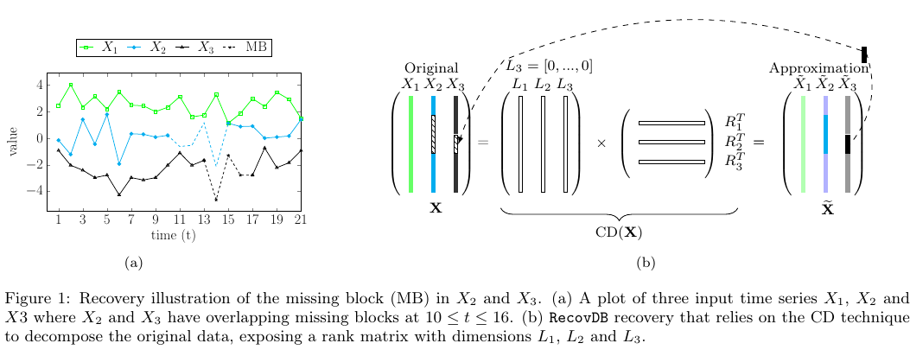
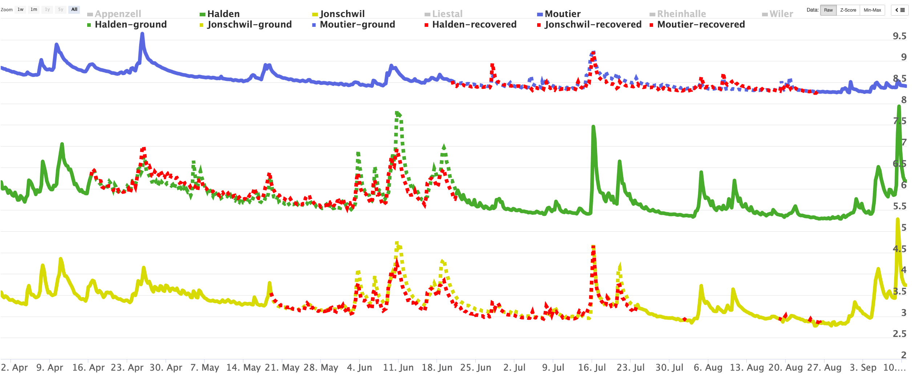

# cdrec

**CDRec** is a matrix-based technique repair large time series. It uses a memory-efficient algorithm to compute the Centroid Decomposition (CD) to recover missing blocks in incomplete time series. Technical details can be found in our ICDE 2014 paper:  <a href = "https://exascale.info/assets/pdf/khayati_ICDE14.pdf">Memory-Efficient Centroid Decomposition for Long Time Series </a>. The properties of CDRec can ve visualized [here](http://revival.exascale.info/cd/signvectors.php).

The code of CDRec is available in C++, Python and Matab. CDRec offers the following salient features:

- Efficient recovery of large missing blocks in time series
- Reconstruct multiple incomplelte time series at a time
- Parameter free and correlation-aware recovery

[**Prerequisites**](#prerequisites)  | [**Execution**](#execution) | [**Recovery Description**](#recovery-description)  | [**Contributors**](#contributors) | [**Citation**](#citation)

___

## Prerequisites
- Numpy (for Python)
- The algorithm takes as input a matrix where the columns are incomplete time series, rows are values, and the missing values are designated as NaN. Algorithm outputs a matrix where all NaN values are recovered.
- The code allows also to perform the decomposition of a matrix where the columns are complete time series.

___

## Execution

- Python: Run 
- C++: Run 
- Matlab: Run

___

## Recovery Description

CDRec represents the input time series as a relation and maps them into loading and relevance vectors that best account for the correlation. The loading vectors (L) expose the rank of the matrix, which is used to accurately recover the missing blocks. The recovery has been tightly integrated into the open-source analytical RDBMS MonetDB as native UDF (see our ICDE'19 [paper](https://exascale.info/assets/pdf/recovdb19.pdf)). 


{:height="100%" width="95%"}


CDRec is also available as a GUI through the [ReVival](http://revival.exascale.info/recovery/recovdb.php) tool. The GUI 
allows users to perform (batch and online) recovery of missing blocks on real-world time series data. Users can select one or
multiple time series from a set of datasets, delete a percentage of data from the selected time series, and then recover
the missing blocks. The tool also illustrates how the correlation across time series can be used to recover missing values.


**Example**:

*Input*: Three water discharge time series each of them has a missing block.

*Query*: Recover all the incomplete time series in one pass.

*Result*: The following figure illustrates the result of the recovery. The missing values are shown in dashed
lines while the recovered blocks are shown in red dashed lines.

{:height="100%" width="100%"}


___

## Contributors

Mourad Khayati (mkhayati@exascale.info) and Zakhar Tymchenko

___

## Citation
```bibtex
@conference{DBLP:conf/icde/KhayatiBG14,
  title = {Memory-efficient centroid decomposition for long time series},
  booktitle = { {IEEE} 30th International Conference on Data Engineering, Chicago, {ICDE} 2014, IL, USA, March 31 - April 4, 2014},
  year = {2014},
  pages = {100{\textendash}111},
  doi = {10.1109/ICDE.2014.6816643},
  author = {Khayati, Mourad and B{\"o}hlen, Michael H. and Gamper, Johann},
}
```
